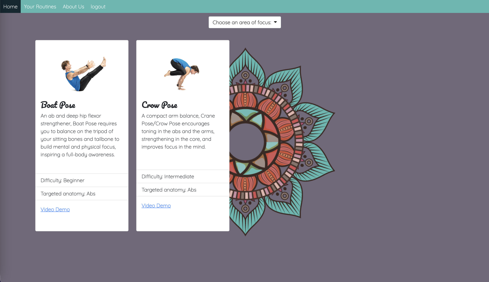

# Namaste Fit

## Table Of Contents
* [Description](#description)
* [Usage](#usage)
* [Technologies Used](#technologies-used)
* [Contributors](#contributors)
----------------------------
## Description
This application allows yoga enthusiasts to learn more about yoga poses. Users can search by targeted anatomy via the dropdown once an account is created and results will populate the page. Our motivation for development is to improve the experience surrounding yoga, share knowledge on the health benefits and allow users to personalize their yoga journey.

---------------------------
## Usage
To use the application, visit the website [here](https://yoga-finish.herokuapp.com/) and enter your desired username and password in the SignUp form. Once logged in choose an area of your anatomy that you would like to focus on. The proper poses per target group will be displayed, there you will find the difficulty level, a quick description of the pose, an image demo and even a link to a live demo via youtube.

---------------------------
## Technologies used
- JavaScript
- HTML
- Handlebars.js
- CSS
- BootStrap
- JQuery

---------------------------
## Contributors
* [Samantha Arellano](https://github.com/sambollano)
* [Fernanda Frers](https://github.com/balloonicorn92)
* [Lacey Griffith](https://github.com/lacey-griffith)
* [Kyle McKinley](https://github.com/kjmckinley)

---------------------------
## Site Images

---------------------------
## Future Development
* Add functionality to save poses as favorites and revist 'favorited' in the future.
* Allow users to build their own routine
* Increase user experience and interaction by allowing comments/feedback on poses

If you have ideas for our application- submit an issue and label it as 'enhancement' and we'll take a look!

